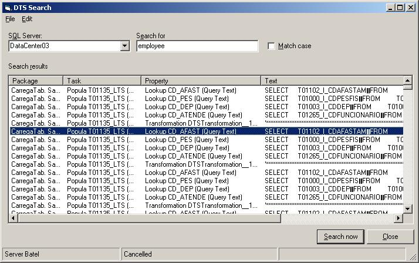



## \[ DTS \] \(Data Transformation Service\) Search Tool

### Description

Search strings in DTS (Data Transformation Services) in SQL SErver. Microsoft don't provide such tool. Allows, for instance, find what task/package contains certain table or field. Accepts a table name, field name or any text and returns the packages/tasks where the text is. This code is usefull when you have lots of DTS packages that perform changes on tables that exist in the various database. Where is that table ??? Find with this tool. Uses SQlDMO.
 
### More Info
 
SQL Server acess is needed

             |
---                |---
**Submitted On**   |2004-08-30 17:27:56
**By**             |[Carlos Alvarado](https://github.com/Planet-Source-Code/PSCIndex/blob/master/ByAuthor/carlos-alvarado.md)
**Level**          |Intermediate
**User Rating**    |4.4 (31 globes from 7 users)
**Compatibility**  |VB 4\.0 \(32\-bit\), VB 5\.0, VB 6\.0
**Category**       |[Complete Applications](https://github.com/Planet-Source-Code/PSCIndex/blob/master/ByCategory/complete-applications__1-27.md)
**World**          |[Visual Basic](https://github.com/Planet-Source-Code/PSCIndex/blob/master/ByWorld/visual-basic.md)
**Archive File**   |[DTSSearch1787718302004\.zip](https://github.com/Planet-Source-Code/carlos-alvarado-dts-data-transformation-service-search-tool__1-55908/archive/master.zip)

